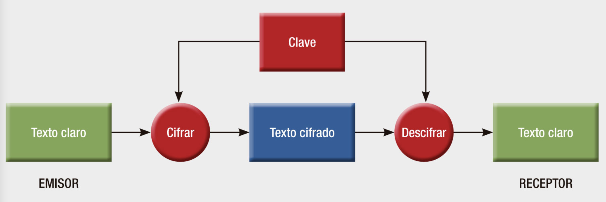

# Gestor de contraseñas

> Este sistema almacena localmente cuentas y contraseñas de manera cifrada.

## Tabla de contenido
* [Información general](#información-general)
* [Teconogías](#teconogías)
* [Instalación](#instalación)
* [Ejecución](#ejecución)
* [Características](#características)
* [Contacto](#contacto)


## Información general

A través de un CLI (Command Line Interface), el usuario podrá cifrar todas las cuentas y contraseñas que desee. Los datos se cifran con el algoritmo AES (Advanced Encryption Standard) por lo que es necesaria una contraseña maestra para cifrar y descifrar los datos almacenados.  



La contraseña maestra se almacena como una cadena hash SHA-256. Es decir, aunque el archivo almacenado sea vulnerado, el intruso no podrá ver la contraseña maestra para descifrar las cuentas almacenadas.

## Teconogías
* Node.js - version >= 8

## Instalación
```console
# npm
> npm install
> 

# or yarn
> yarn
>
```

## Ejecución
```console
> node index.js
```

## Ejemplos de código
Función para cifrar
```js
function getEncryptedString(data, masterPassword) {
  return CryptoJS.AES.encrypt(JSON.stringify({
    accounts: data
  }), masterPassword).toString();
}
```

Función para descifrar
```js
async function getDecodedAccounts(storage, masterPassword) {
  let decodedAccounts = {};
  const ciphertext = await storage.getItem('accounts');

  if (ciphertext) {
    const bytes  = CryptoJS.AES.decrypt(ciphertext, masterPassword);
    const originalText = bytes.toString(CryptoJS.enc.Utf8);
    decodedAccounts = JSON.parse(originalText).accounts;
  }

  return decodedAccounts
}
```

Nótese que ambas funciones hacen uso de la contraseña maestra como se muestra en el diagrama de flujo del algoritmo [AES](#información-general).

## Características
- [x] Agrega cuentas y contraseñas
- [x] Edita datos existentes
- [x] Muestra el nivel de seguridad de cada password

Por implementar:
- [ ] Cambiar contraseña maestra

## Contacto
Creado por [@jlimons](https://www.jalisa.xyz/)
